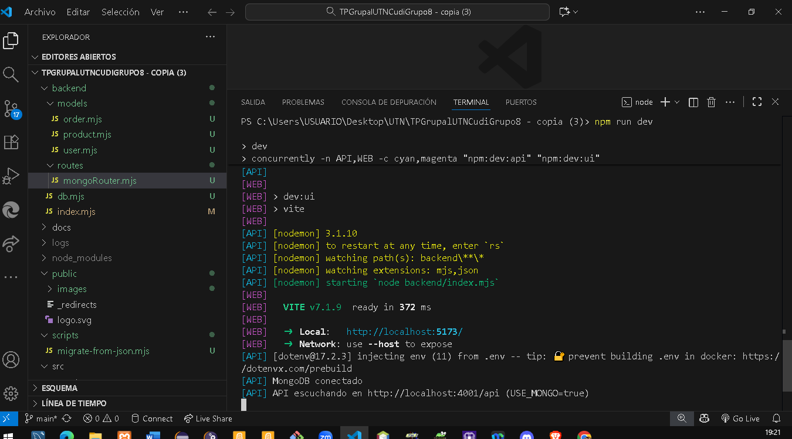

# Grupo 8 – UTN CUDI – Tienda (SPA + API)
### Diplomatura Desarrollo Web I – 2025

**Resumen:** Proyecto full‑stack con frontend SPA (Vite + React) y backend API (Node + Express). La **persistencia principal es MongoDB Atlas** vía Mongoose. Se mantiene un **modo alternativo JSON** solo para práctica/offline.

---

## Tecnologías utilizadas
- **Frontend:** Vite + React
- **Backend:** Node.js + Express
- **Base de datos (principal):** MongoDB Atlas (Mongoose)
- **Autenticación:** JWT (signup/login), rol `admin` por `ADMIN_EMAIL`
- **Scripts:** Migración desde `db.json` a Mongo

---

## Comandos rápidos

| Tarea | Comando |
|------|---------|
| Instalar dependencias | `npm install` |
| Ejecutar en **Mongo (dev)** | `npm run dev` |
| Migración **simulada** (JSON→Mongo) | `npm run migrate:json:dry` |
| Migración **real** (JSON→Mongo) | `npm run migrate:json` |
| Build (si aplica) | `npm run build` |

---

## Configuración de entorno (`.env`)

> **Mongo es el modo principal.** Solo definí `MONGO_URL` y dejá `USE_MONGO=true`.

```env
USE_MONGO=true
MONGO_URL=mongodb+srv://<usuario>:<password>@<cluster>/<nombreDB>?retryWrites=true&w=majority
PORT=4001
FRONT_ORIGIN=http://localhost:5173
VITE_API_URL=http://localhost:4001/api
JWT_SECRET=dev-super-secret
ADMIN_EMAIL=admin@tienda.com
```

## Cómo correr el proyecto (Mongo — modo principal)

1. Crear `.env` con las variables de arriba (pegá tu `MONGO_URL` de Atlas).  
2. Instalar dependencias:
   ```bash
   npm install
   ```
3. Levantar entorno de desarrollo (API + Web):
   ```bash
   npm run dev
   ```
4. Verificar en consola del API:
   ```
   MongoDB conectado
   API escuchando en http://localhost:4001/api (USE_MONGO=true)
   ```
5. Navegar:
   - **Web**: `http://localhost:5173`
   - **API**: `http://localhost:4001/api/products`

---

## Migración de datos desde `db.json` → Mongo

- **Simulación (no escribe):**
  ```bash
  npm run migrate:json:dry
  ```
- **Migración real:**
  ```bash
  npm run migrate:json
  ```
Esto crea/actualiza colecciones `users`, `products`, `orders`.

---

## Modo alternativo JSON (opcional)

> Solo para práctica/offline. 

En `.env` podés conmutar:

```env
USE_MONGO=false
VITE_API_URL=http://localhost:4001/api
```

Luego `npm run dev`.

---

## 📷 Evidencias del funcionamiento (con MongoDB)

### 01. Sesión de usuario y admin


### 01c. Home


### 02. Registro y login


### 03. Productos por categoría


### 04. Alta/Edición y eliminación


### 05. Validaciones en creación de producto


### 06. Edición confirmada


### 07. Eliminación reflejada en listado


### 08. Carrito


### 09. Checkout


### 10. Compras (listado)


### 11. Cambios de estado


### 12. Compra manual


### 13. **MongoDB conectado (modo principal)**


---

## Credenciales de prueba

**Admin**
- Email: `admin@tienda.com`
- Password: `utn123`

**Usuario**
- Email: `griselmolina1970@gmail.com`
- Password: `Juan1970`

> Recordatorio: el rol admin se asigna al email configurado en `ADMIN_EMAIL` del `.env`.

---

## Estructura del proyecto (resumen)

```
backend/
  index.mjs
  db.mjs
  models/
    user.mjs
    product.mjs
    order.mjs
  routes/
    mongoRouter.mjs

public/
  images/

scripts/
  migrate-from-json.mjs

src/
  ... (Vite + React)

docs/
  capturas/
    (ver imágenes referenciadas en minúsculas)

.env
```

---

## Créditos

**Grupo 8 — Diplomatura Desarrollo Web I 2025 (UTN)**  
**Integrantes:** Axel · Magalí · Diego · Daniela · Griselda  
**Profesor:** Axel Leonardi